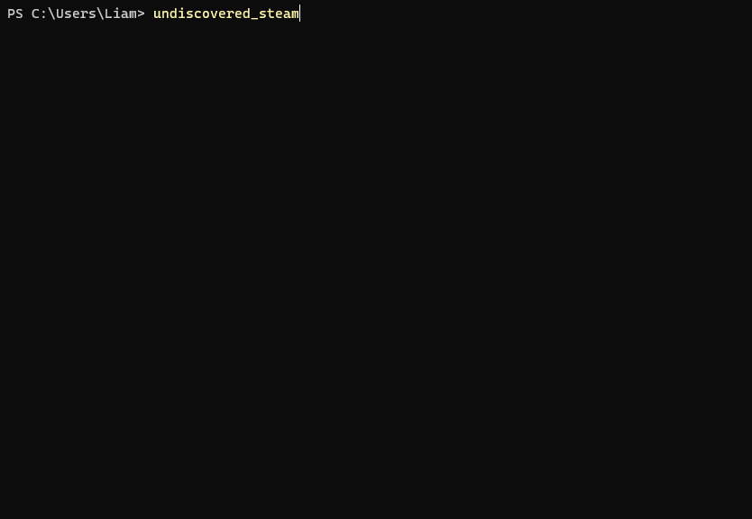

# Undiscovered Steam

A CLI for finding Steam games nobody has heard of

## How it works

The program uses the Steam web API to preform a search with randomly selected word. Another request is then preformed for the full app data for each of the results. These results are then filtered according to your selected options.

## Options

These are the current options you can filter by

- Max Price
- Max Review Count
- Supported Platforms

## Keybinds

| Key              | Description           |
|------------------|-----------------------|
| <kbd>↑/↓</kbd>   | Move selection        |
| <kbd>Enter</kbd> | Proceed / Open        |
| <kbd>Space</kbd> | Toggle multiselect    |
| <kbd>1..9</kbd>  | Jump to index in list |
